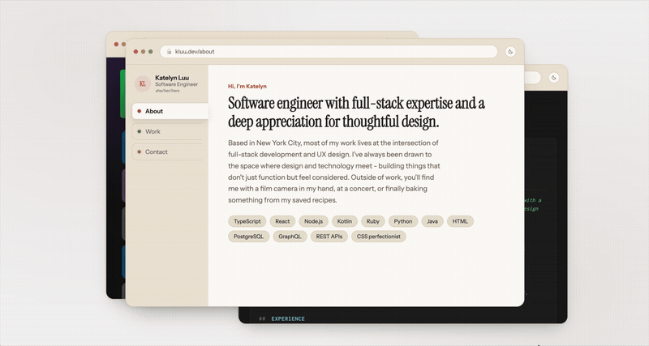

# Katelyn's Dev Portfolio

My one-page, interactive portfolio built as little browser windows: vertical tabs for
About / Work / Contact, a draggable chrome bar, and a light/dark toggle.



## Stack

- React + TypeScript
- Vite
- CSS

## Run it

```bash
npm install
npm run dev
```

Then open the printed local URL in your browser.

## How it's organized

```
src/
  components/        — one folder per component, each with its own .tsx + .css
  data/              — career history + project content, as typed data
  hooks/             — useTheme (dark mode) and useDraggable (window dragging)
  styles/            — shared design tokens + panel styles
```
